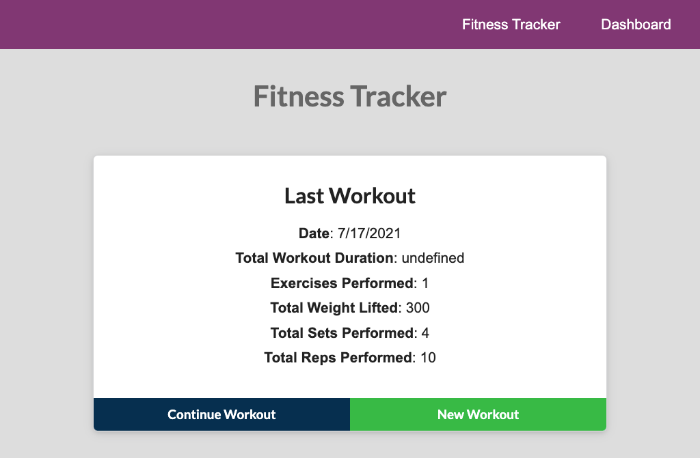
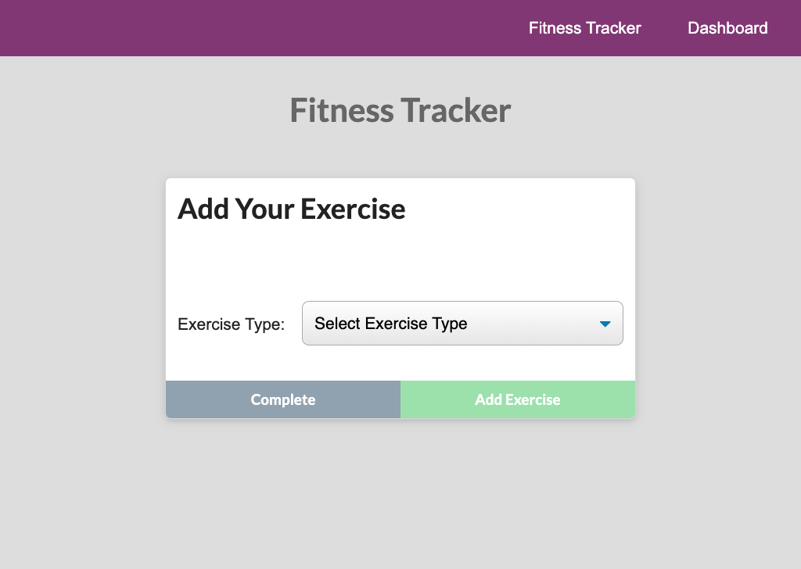
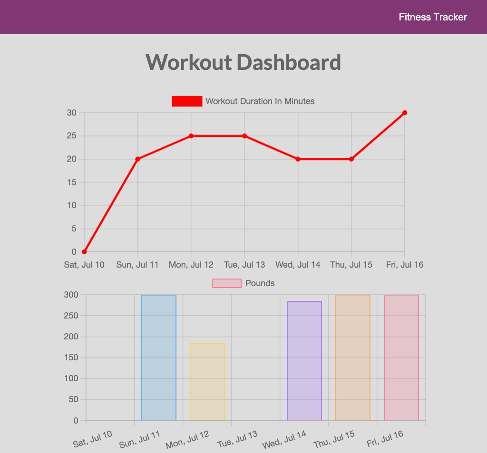
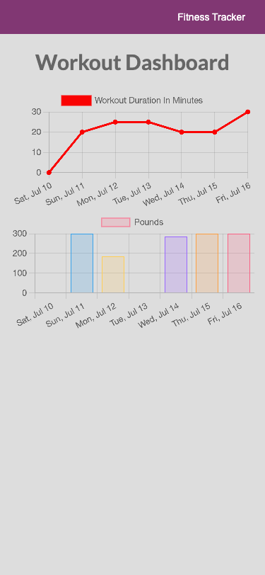

# Workout Tracker
  

  ## Description
  As a user, I want to be able to view create and track daily workouts. I want to be able to log multiple exercises in a workout on a given day. I should also be able to track the name, type, weight, sets, reps, and duration of exercise. If the exercise is a cardio exercise, I should be able to track my distance traveled. A consumer will reach their fitness goals more quickly when they track their workout progress. The application uses Node, NPM, Express, MongoDB, Mongoose and Heroku.

  ## Table of Contents
  * [Installation](#installation)
  * [Usage](#usage)
  * [License](#license)
  * [Contributing](#contributing)
  * [Tests](#tests)
  * [Questions](#questions)
  
  ## Installation
  In order to download necessary tools, first clone the repository. Navigate inside the project folder. If you do not have Node.js or npm installed, you will first need to install them.
  [Install Node.js and npm](https://docs.npmjs.com/downloading-and-installing-node-js-and-npm)

  ## Usage
  [Link to Heroku Deployment](https://workout-tracker-ll.herokuapp.com/)
  Click on the New Workout button on the landing page to record a new workout. Navigate to the Dashboard to see charts of previous workouts over time.

  :camera: 
  
  
  
  

  

  ## License
  Licensed under [Apache License 2.0](https://www.apache.org/licenses/LICENSE-2.0.html).

  ## Contributing
  Anyone can participate in the project to submit bugs and make pull requests for anything from typos to new content.
  If you are interested in fixing issues and contributing to this project, please refer to the [Contributor Covenant](https://www.contributor-covenant.org/).

  ## Tests
  Currently no tests exists for the application. 
  If you would like to contribute and help us by writing them, see the [Contributing](#contributing) section.

  ## Questions
  For more information about me and my other projects, visit my [GitHub profile](https://github.com/LindseyJeeJan).
  Reach me to report issues or with questions at [ljjlauria@mac.com](mailto:ljjlauria@mac.com).
